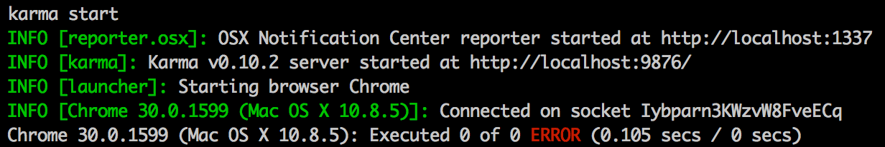

[node]: http://nodejs.org/
[mocha]: http://visionmedia.github.io/mocha/
[Karma]: http://karma-runner.github.io/0.10/
[Chai]: http://chaijs.com/
[Sublime]: http://www.sublimetext.com/
[Sinon]: http://sinonjs.org/
[karma-sinon-chai]: https://npmjs.org/package/karma-sinon-chai
[decodeURIComponent]: https://developer.mozilla.org/en-US/docs/Web/JavaScript/Reference/Global_Objects/decodeURIComponent
[github]: https://github.com
[hontas]: https://github.com/hontas
[githubProj]: https://github.com/hontas/queryStringParser
[terminalWiki]: http://en.wikipedia.org/wiki/Terminal_(OS_X)
[bashWiki]: http://en.wikipedia.org/wiki/Bash_(Unix_shell)
[feedme]: https://github.com/hontas/queryStringParser/blob/master/FEEDME.md
[packagejson]: http://package.json.nodejitsu.com/
[git]: http://git-scm.com/downloads
[BDD]: http://en.wikipedia.org/wiki/Behavior-driven_development
[TDD]: http://en.wikipedia.org/wiki/Test-driven_development
[@pontahontas]: https://twitter.com/pontahontas

# Test-driving TDD

by [@pontahontas][@pontahontas] November 2013

A friend asked me the other day - *How can I read get-parameters from a URL and parse it into a JavaScript object?* And I thought - *Perfect opportunity for a little TDD!*

I'm assuming you have some knowledge of JavaScript, that you have [node][node] installed and that you know your way around a shell such as the [Terminal][terminalWiki] or [git-bash][git].

You'll find all files for this article here: [https://github.com/hontas/queryStringParser][githubProj]

## What is test-driven development?

TDD is a software development process that looks like this:  
  

Want to know more, check this out:

* [Test-driven development (wikipedia)][TDD]
* [JavaScript TDD by Ricky Clegg (slides)](https://speakerdeck.com/rickyclegg/javascript-tdd)
* [Test-Driven JavaScript Development (book)](http://tddjs.com/)
* [Programming, only better, by Bodil (vimeo)](http://vimeo.com/74452549)

## Requirements

Take the query string `?taste=sweet%2Bsour&taste=salty%2Bdelicious&taste=frosty&start=&end=` and turn it into a JavaScript object that look like this:

```js
{
	taste: [sweet, sour, salty, delicious, frosty],
	start: "",
	end: ""
}
```

## Setup

We'll be using [Karma][Karma] as our test-runner, with the [mocha test framework][mocha] and [Chai assertion library][Chai]. I'll be using [my favorite text editor][Sublime], you can use whichever you like.

Begin by creating a new folder for the project and navigate to it (I named mine *queryStringParser*)

```
mkdir queryStringParser
cd queryStringParser
```

### npm

Managing dependencies is a very good thing, but out of scope for this article. However I encourage you to use `package.json`, you can read about it [here](http://blog.nodejitsu.com/package-dependencies-done-right) and [here][packagejson].

### Karma

Install [Karma][Karma] globally, then install the karma-mocha- and the karma-chai-plugin and finally create a karma configuration file. I list my answers below.

```
npm install -g karma
npm install karma-mocha
npm install karma-chai
karma init
```
* testing framework: *mocha*
* Require.js: *no*
* Capture browser: *Chrome*
* Location of source/test files: _js/\*.js_
* Location of source/test files: _test/\*\*/\*-test.js_
* Exclude files:
* Watch all the files: *yes*

**Note:** If you're on windows, you might have to set an environment variable like `CHROME_BIN=%ProgramFiles(x86)%\Google\Chrome\Application\chrome.exe` to get the chrome launcher to work. You can [read about how to do this here](http://www.nextofwindows.com/how-to-addedit-environment-variables-in-windows-7/).

Open the newly created file `karma.conf.js` in your favorite text editor and add *chai* to frameworks. If you're on a mac, you'll want the osx-reporter too: `npm install karma-osx-reporter` and add it to reporters.

```js
// karma.conf.js
frameworks: ['mocha', 'chai'],
reporters: ['progress', 'osx'], // if you're on a mac
```

#### File structure

Finally create two folders and two files, `js/queryStringParser.js` and `test/queryStringParser-test.js` - which correspond to the file pattern we set up in the `karma.conf.js`-file.

Try it out by typing `karma start` in your shell which should output something like this:  
  
 The `ERROR` is just saying thet we have no tests yet, so let's take care of that.

## Writing tests

The philosophy of [test driven development][TDD] is that you cannot write a single line of code without having written a failing test case first.

### Our first failing test case

We're using [the mocha test framework][mocha] with [Chai assertian library][Chai] and we'll be writing our tests in [BDD-flavor][BDD]. To read up on the Chai-syntax, [take a look here](http://chaijs.com/api/bdd/) and keep it open for reference.

We will create a function that transforms the query string into a js-object, so open up `test/queryStringParser-test.js` and enter:

```js
describe("queryStringParser", function() {
	it("should be a function", function() {
		expect(queryStringParser).to.be.a('function');
	});
});
```

First we `describe` what it is we will be testing: *"queryStringParser"*.  
Then we describe what `it` is we expect: *"should be a function"*.  
And last we test if our `expect`-ations are true.

Save the file and take a look at the test in your shell - it should fail. To fix it open up `js/queryStringParser.js` and enter:

```js
var queryStringParser = function() {};
```

Take a look at the test again, it should now be green. Awesome! Test driven development FTW! Give yourself a big pat on the back and let's continue. Our approach is to **not write any code** without **first having written a failing test**. This means we need another test!

### Test function input

Since we will be parsing a *query string* we may want to throw an error if the input is not a string. We'll test for that with an *asynchronous* test, meaning that the test case will not be fulfilled until `done()` is called. Notice the `done` in `function(done)`. Put this test below the first `it`.

```js
it("should throw error if input is not a string", function(done) {
	try {
		queryStringParser();
	} catch (e) {
		done();
	}
});
```

You can [read more about testing asynchronous code here](http://visionmedia.github.io/mocha/#asynchronous-code).

```js
var queryStringParser = function(queryString) {
	if ("string" !== typeof queryString) {
		throw new Error("Input parameter must be string");
	}
};
```

### Test function output

The requirements state that we should *"turn it [the query string] into a JavaScript object"*, so let's make sure the function returns just that.

```js
it("should return an object", function() {
	var res = queryStringParser('');
	expect(res).to.be.an("object");
});
```

Notice I'm passing an empty string to `querStringParser()` above, because otherwise it will throw the error we specified before. Make sure it's failing, and then make it pass.

```js
var queryStringParser = function(queryString) {
	if ("string" !== typeof queryString) {
		throw new Error("Input parameter must be string");
	}
	return {};
};
```

We only want to make the test pass, **nothing more** - faithfully abiding to [the principle of least effort](http://en.wikipedia.org/wiki/Principle_of_least_effort).

### Test output data

Now let's divide the queryString into key/value-pairs that will be on the returned object.

```js
it("should return object with keys extracted from queryString", function() {
	expect(queryStringParser('key=value&prop=thing')).to.have.keys(['key', 'prop']);
});
```

One small step for the test, a giant leap for our function:

```js
var queryStringParser = function(queryString) {
	if ("string" !== typeof queryString) {
		throw new Error("Input parameter must be string");
	}

	var ret = {};

	// extract keys
	queryString.split('&').forEach(function(keyVal) {
		ret[keyVal.split('=')[0]] = "";
	});

	return ret;
};
```

### Extend the test case

And then a test to make sure that the value makes it through as well, we change the test into this:

```js
it("should return object with keys extracted from queryString", function() {
	var res = queryStringParser('key=value&prop=thing');
	expect(res).to.have.property('key').that.equal('value');
	expect(res).to.have.property('prop').that.equal('thing');
});
```

Make sure the tests are failing, and then

```js
// extract key/value-pairs
queryString.split('&').forEach(function(keyVal) {
	var keyValArr = keyVal.split('='),
		key = keyValArr[0],
		val = keyValArr[1];
	ret[key] = val;
});
```

### Remove the questionable mark

```js
it("should remove the initial question mark from queryString", function() {
	expect(queryStringParser("?key=val")).to.have.property("key");
});

```

I'm using `slice` for this but you can choose to use `substr` or `substring` if you wish. Take a look at [these performance tests](http://jsperf.com/substring-extraction-methods-substring-substr-slice) before making up you mind. Place this code above the forEach.

```js
if (queryString.charAt(0) === "?") {
	queryString = queryString.slice(1);
}
```
### Decode query string

```js
it("should replace each escaped sequence in the encoded URI component", function() {
	var author = "Arthur C. Clarke",
		res = queryStringParser("?author=" + encodeURIComponent(author));
	expect(res.author).to.equal(author);
});
```

For this we'll be using [decodeURIComponent][decodeURIComponent].

```js
if (queryString.charAt(0) === "?") {
	queryString = decodeURIComponent(queryString.slice(1));
} else {
	queryString = decodeURIComponent(queryString);
}
```

### Split by plus

Now it appears the friend (our requirements) wishes us to split values containing `%2B` (decoded to `+`) into an array. I say ok.

```js
it("should turn +-separated values into array", function() {
	var letters = "A+B+C+D",
		res = queryStringParser("?letters=" + encodeURIComponent(letters));
	expect(res.letters).to.eql(letters.split("+"));
});
```

Note: `to.eql` can also be expressed as `to.deep.equal`

```js
// meanwhile in the forEach...
if (/\+/.test(val)) {
	val = val.split("+");
}
ret[key] = val;
```

### Concatenate values

According to the friend it should be possible to input the same key several times which should then append that value to the previous array.

```js
it("should concatenate values to keys that already hold an array", function() {
	var res = queryStringParser("nums=1%2B2&nums=3%2B4");
	expect(res.nums).to.eql(['1', '2', '3', '4']);
});
```

Investigate, then concatenate!

```js
if (ret[key] && Array.isArray(ret[key])) {
	val = ret[key].concat(val);
}
ret[key] = val;
```

I'm aware this will not work if the first value only holds one value (no plus-sign), but I'm leaving it like this for now because this solution is sufficient to meet our requirements. And when they change, we add more tests.

### El grande finale - one test to rule them all

One final test to see that we meet the requirements.

```js
it("should meet the requirements", function() {
	var str = '?taste=sweet%2Bsour&taste=salty%2Bdelicious&taste=frosty&start=&end=',
		res = queryStringParser(str);
	expect(res).to.have.property('taste')
		.that.eql(['sweet', 'sour', 'salty', 'delicious', 'frosty']);
	expect(res).to.have.property('start').that.equal("");
	expect(res).to.have.property('end').that.equal("");
});
``` 

Hallelujah, it's working! Praise the test driven JavaScript [flying spaghetti monster!](http://en.wikipedia.org/wiki/Flying_Spaghetti_Monster)

## Refactoring the code

With all those tests making sure our code is working you can go ahead and re-factor it in a worry-free fashion!
Below are links to the latest version of the files.

* [test/queryStringParser-test.js](https://github.com/hontas/queryStringParser/blob/master/test/queryStringParser-test.js)
* [js/queryStringParser.js](https://github.com/hontas/queryStringParser/blob/master/js/queryStringParser.js)

## Suggested improvements

1. Maybe my friend decides he wanna be able to throw a whole URL on the function, then our question-mark-splice-remover no longer holds up. Try to add a test case for this and then improve the code to handle whole URL's as well.

2. What if the new value is an array but not the old? Try writing a test case that account for that and then get it working.

## Taking it further

This was one very simple function, but when you are working with, let's say objects and methods, then it's a good idea to nest the `describe`'s so that they reflect the structure of the code. I put a hash before method names and a dot before property names and I also frequently make use of `beforeEach` which executes before each test. Below is an example to give you an idea. You can read more about it on [mocha's website](http://visionmedia.github.io/mocha/).

I also highly recommend trying out [sinonjs][Sinon] which gives you `spies`, `mocks`, `stubs` and a whole range of other tools that make your testing days easier than winning a tanning contest with a true nerd.

```js
// test/models/person-test.js
describe("Person", function() {
	
	var person;

	beforeEach(function() {
		// one fresh instance of Person before each test
		person = new Person;
	});

	describe("#ctor", function() { // constructor
		it("should set correct properties", function() {
			expect(person.friends).to.be.an("array").with.length(0);
			expect(person.age).to.equal(0);
		});
	});

	describe("#fullName", function() { // method
		it("should return full name", function() {
			person.set('firstName', 'Donald');
			person.set('lastName', 'Duck');
			expect(person.fullName()).to.equal('Donald Duck');
		});
	});

	describe(".version", function() { // property
		it("should be 1.0.1", function() {
			expect(Person.version).to.equal('1.0.1');
		});
	});
});
```

## Final thoughts

In the beginning of my testing days I found it hard to define what and how to test. I spent a lot of time trying to figure out what to test, how to test it and how to write good test descriptions. I'm still working on this, but it's more easy now, it comes naturally and I don't feel that it is slowing me down. Actually I find myself thinking about how to write tests first.

So I ask you, in the words of Jamie Walters: [Hold on, till you feel a little stronger. Hold on, to TDD](http://youtu.be/k_QGJE94iOM).

And when the initial tests are in place, refactoring is a breeze, and coming back to an old piece of code I don't have to be afraid of breaking it. It keeps me from chewing on my knuckles, throwing furniture around and harassing my environment, it's a peace-keeper and someday I hope the [Nobel commity](http://www.nobelprize.org/) will acknowledge this.

Don't hesitate to give me feedback, questions and suggested improvements. If something was unclear or not working for you, I'll try and answer as fast as I can. Thank you for reading.

//Pontus, [hontas][hontas], [@pontahontas][@pontahontas]